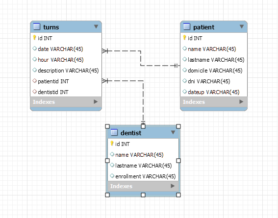
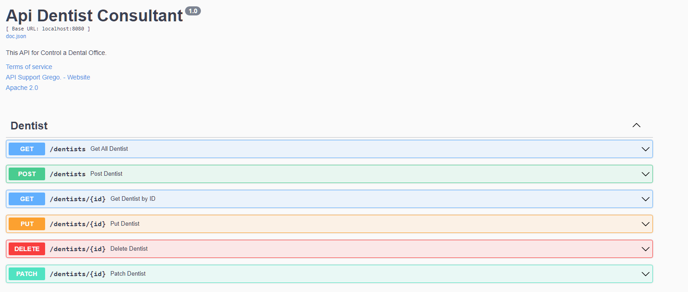

# Api Dentist Office by Grego Martinez
## 🔗 Links

🌍 [English](#English) - 🌍 [Spanish](#Español)

## English

Project name: Api-Dentist

General summary of the project: Individual Project for the final delivery of the subject Backend Specialization, Golang.

### Used technology
- IDE: Visual Studio Code
- Golang with Gin-Gonic
- MySQL Database
- Docker for Database
- Swagger for Documentation

## Related

Here are some related project.

## Español

Nombre del proyecto: Api-Dentist

Resumen general del proyecto: Proyecto Individual para la entrega final de la materia Especializacion en Backend, Golang. 

### Tecnologías utilizadas
- IDE: Visual Studio Code
- Golang with Gin-Gonic
- MySQL Database
- Docker for Database
- Swagger for Documentation

Podran ver la documentacion completa corriendo el proyecto en: localhost:8080/docs/index.html
